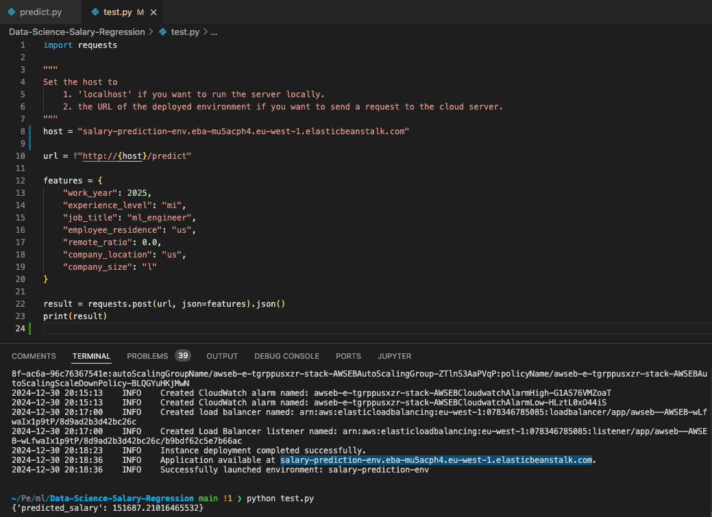

# Data Science Salary Prediction

A Flask web service to predict salaries of people in data science field based on information about their job such as work year, experience level, job title, and so on. A Random Forest Regressor is used to predict the salaries.

## Technical Stack

- Python 3.9
- Flask for API service
- Docker for containerization
- AWS Elastic Beanstalk for cloud deployment

## Project Structure

```
.
├── data                   # Information on dataset
├── notebook.ipynb         # All the steps to analyze data and train the model
├── train.py               # notebook.ipynb is converted to python script
├── predict.py             # Flask application
├── test.py                # Send request to application
├── model.bin              # Pickled model and dict vectorizer
├── Dockerfile             # Dockerfile for containerization
├── Pipfile                # Pipfile for dependency management
├── Pipfile.lock     
├── aws-deployment-link.png
└── README.md
```

## Installation

1. Clone the repository:
~~~
git clone https://github.com/azad96/Data-Science-Salary-Regression.git
cd Data-Science-Salary-Regression
~~~

2. Install dependencies using Pipenv:
~~~
pip install pipenv
pipenv install
~~~

3. Activate the environment:
~~~
pipenv shell
~~~

## Running the Project

1. Start the Flask server locally:
~~~
python predict.py
~~~

2. The service will be available at `http://localhost:9696`

3. Make sure the host is set to `localhost:9696` in test.py. Then, send POST requests to `/predict` endpoint with test.py:
~~~
python test.py
~~~

Response format: {'predicted_salary': 75000.0}

## Docker Containerization

1. Build the image:
~~~
docker build -t salary-prediction .
~~~

2. Run the container:
~~~
docker run -it --rm -p 9696:9696 salary-prediction
~~~
This will start the Flask server automatically, so you can send a request with test.py as before:
~~~
python test.py
~~~

## Cloud Deployment

The project is configured for AWS Elastic Beanstalk deployment. Use the AWS EB CLI for deployment:
~~~
pipenv install --dev
eb init -p docker -r eu-west-1 salary-prediction
eb create salary-prediction-env --enable-spot
~~~
When the environment is launched successfully, find the line `INFO Application available at URL` in the logs of eb create command.
Copy the URL and set it as the `host` variable in test.py. Then, you can send a request by running:
~~~
python test.py
~~~


When you are done, you can terminate the environment by running:
~~~
eb terminate salary-prediction-env
~~~
